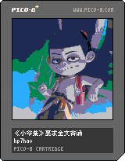
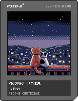
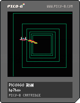
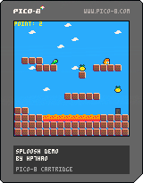
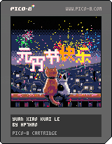

# PICOVIBE

这是一个PICO-8的爱好者项目，为了方便国内爱好者相互交流，方便游戏分享，本项目致力于以下目标。

* 提供一些简单的工具以及类库
* 收集国内PICO-8爱好者开发的游戏作品

# 项目版权说明

本项目包含多个pico-8子项目，每个子项目的版权属于其署名的作者。
请确保在使用或分发这些项目时遵守相应的版权协议。

| 标题 | 图片 | 状态 |
|------|------|------|
| i18ndemo 多语言示例（中文） |  | - |
| nezhapoems 《小爷集》要求全文背诵 |  | 开发中 |
| pico8go-systeminfo pico8go 掌机系统信息 |  | - |
| pico8go-thanks pico8go 掌机致谢 |  | - |
| splooshdemo |  | - |
| yxkl 元宵节快乐 |  | - |

# 工具说明

[pico8i18n](./tools/pico8i18n/README.md)
[img2p8](./tools/img2p8/README.md)

# 致谢

#### deps/picotool
	https://github.com/dansanderson/picotool.git

#### tools/customcart/main.c
	https://github.com/usrshare/pico8-customcart.git

#### carts/pico8pixelbomb/pico8go-thanks
	SPRWAR.p8 by randc0degen