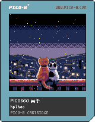

# PICOVIBE

这是一个PICO-8的爱好者项目，为了方便国内爱好者相互交流，方便游戏分享，本项目致力于以下目标。

* 提供一些简单的工具以及类库
* 收集国内PICO-8爱好者开发的游戏作品

# 项目版权说明

本项目包含多个pico-8子项目，每个子项目的版权属于其署名的作者。
请确保在使用或分发这些项目时遵守相应的版权协议。

| 标题 | 图片 | 状态 |
|------|------|------|
| i18ndemo<br/>多语言示例（中文） |  | - |
| nezhapoems<br/>《小爷集》要求全文背诵 |  | 开发中 |
| pico8go-about<br/>pico8go 关于(掌机) |  | - |
| pico8go-thanks<br/>pico8go 致谢(掌机) |  | - |
| splooshdemo |  | - |
| yxkl<br/>元宵节快乐 |  | - |

# 编译工具

## 使用方法

```bash
./build_pico8cart.sh <p8文件路径> [模板名称]
```

参数说明：
- `p8文件路径`: 要编译的PICO-8游戏文件路径（.p8文件）
- `模板名称`: 可选参数，指定要使用的卡带模板。如果不指定，将使用meta文件中配置的模板或默认模板

示例：
```bash
# 使用默认模板
./build_pico8cart.sh carts/pico8pixelbomb/pico8go-about/pico8go-about.p8

# 指定使用特定模板
./build_pico8cart.sh carts/pico8pixelbomb/pico8go-about/pico8go-about.p8 custom
```

脚本会自动：
1. 检测并构建所有配置的语言版本
2. 生成对应的翻译文件
3. 使用PICO-8导出卡带图片
4. 应用指定的卡带模板
5. 生成最终的多语言卡带文件

所有生成的文件将保存在 `release` 目录下。

# 工具说明

[pico8i18n](./tools/pico8i18n/README.md)
[img2p8](./tools/img2p8/README.md)


# 致谢

#### deps/picotool
	https://github.com/dansanderson/picotool.git

#### tools/customcart/main.c
	https://github.com/usrshare/pico8-customcart.git

#### carts/pico8pixelbomb/pico8go-thanks
	SPRWAR.p8 by randc0degen


# PICO-8 像素炸弹！

企鹅交流群：143554779