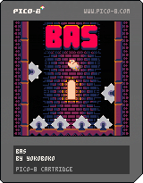

# 小鸡蹦蹦跳 (BAS) 中文 + 振动

## 游戏介绍

欢迎来到《小鸡蹦蹦跳》！这是一款充满乐趣的跳跃冒险游戏，由 yokozuna 精心制作，由 hp7hao 尽心翻译，同时添加了振动支持。

### 游戏特色

🐤 **可爱小鸡角色** - 控制一只活泼可爱的小鸡，在充满挑战的世界中跳跃冒险

🎮 **简单易上手** - 操作简单，适合所有年龄段的玩家

📱 **PICO8GO 振动支持** - 在 PICO8GO 平台上体验独特的振动反馈，让游戏更加沉浸

🏆 **挑战高分** - 挑战你的最高分记录，看看你能跳多远

### 游戏玩法

- 控制小鸡进行跳跃
- 避开障碍物和危险

### 平台支持

- **PICO8GO**: 完整支持，包括振动反馈功能
- **其他 PICO-8 平台**: 基础游戏功能

### 开发者

- **作者**: yokoboko
- **版本**: 中文版

准备好和小鸡一起开始蹦蹦跳跳的冒险了吗？让我们开始吧！

---

*在 PICO8GO 上体验最佳游戏效果，享受独特的振动反馈！*
