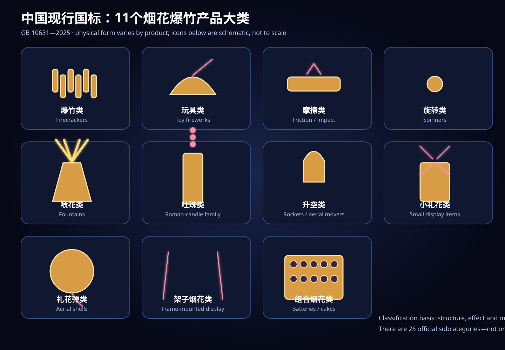
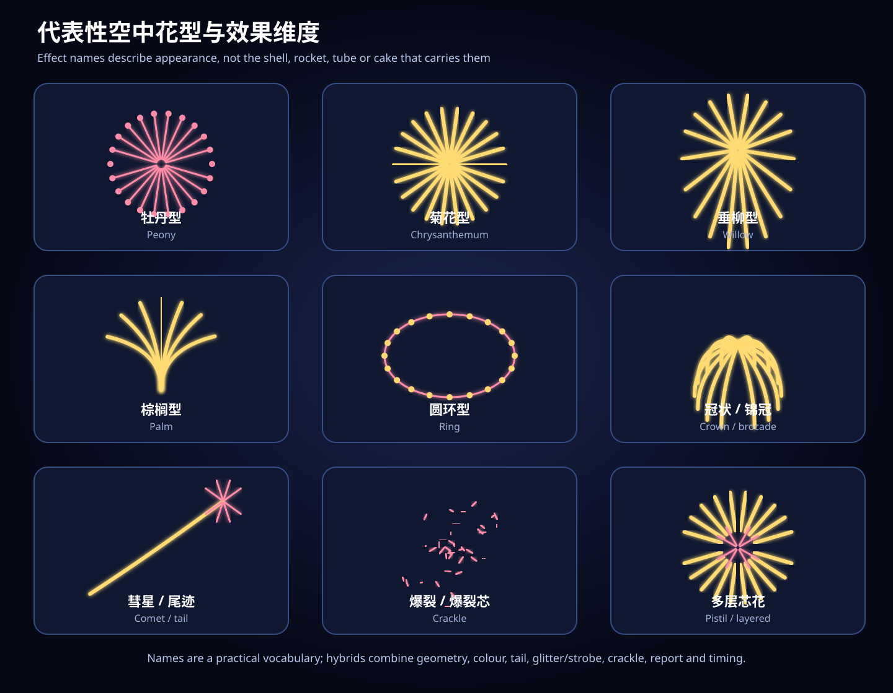

# Chinese Firework Taxonomy, Physical Forms, and Effects

Date: 2026-07-15

Status: non-authoritative Picovibe research note

Scope: research input for Firework Simulators; no cart behavior or naming decision is made here

## Executive answer

There is no single finite count for “how many fireworks exist.” Three answers are useful:

1. China’s current national standard, GB 10631—2025, defines exactly **11 product classes and 25 subclasses**. It classifies products by structure, effect, and motion path.[1][2]
2. Names such as 牡丹型 (peony), 菊花型 (chrysanthemum), 垂柳型 (willow), 棕榈型 (palm), 圆环型 (ring), and 锦冠 (brocade crown) describe visible effects. No authoritative source found gives a closed, exhaustive count of these names.
3. Retail products and shows create effectively unbounded combinations of carrier, burst geometry, colour, trail duration, glitter, crackle, sound, timing, multiple breaks, and choreography.

For Picovibe, this note therefore recommends a **curated set of 50 simulator candidates**, ordered from small/local/simple to large/layered/complex. “50” is a game-content target, not an official classification count.

GB 10631—2025 was published on 2025-10-31, became effective on 2026-05-01, and is marked current by the national standards service.[1] It supersedes the 2013 edition and several product-specific standards.[2]

The illustration is an original schematic. It communicates product-family silhouettes, not construction details or mandatory retail designs.

## What “how many” means

| Question | Defensible answer | Use in Firework Simulators |
|---|---:|---|
| How many regulated Chinese product categories? | 11 classes, 25 subclasses | Ground-truth carrier taxonomy |
| How many named aerial effects? | No closed official count found | Open visual vocabulary |
| How many products or show combinations? | Indefinite and continuously changing | Curated content, not an enumerable catalog |

The standard defines functional structure and behavior. It does not require every member of a class to share one retail silhouette. Packaging, casing proportions, labels, and decorative wrappers vary by producer and product.

## Official Chinese taxonomy: 11 classes and 25 subclasses

This table summarizes GB 10631—2025 §4.1, table 1. The Chinese names are the official terms; English glosses are descriptive.[2]

| # | Official class | Official subclasses | Count |
|---:|---|---|---:|
| 1 | 爆竹类 — firecrackers | 黑药爆竹; 白药爆竹 | 2 |
| 2 | 玩具类 — novelty/toy fireworks | 玩具造型; 烟雾型; 线香型 | 3 |
| 3 | 摩擦类 — friction/impact fireworks | 砂炮; 摔炮; 拉炮 | 3 |
| 4 | 旋转类 — rotating fireworks | 有固定轴旋转烟花; 无固定轴旋转烟花 | 2 |
| 5 | 喷花类 — fountains | 手持式喷花; 地面喷花 | 2 |
| 6 | 吐珠类 — repeating star-tube products | 手持式吐珠; 固定式吐珠 | 2 |
| 7 | 升空类 — ascending products | 火箭; 双响（二踢脚）; 旋转升空 | 3 |
| 8 | 小礼花类 — small display fireworks | 小礼花 | 1 |
| 9 | 礼花弹类 — aerial shells | 礼花弹; 礼花弹组合 | 2 |
| 10 | 架子烟花类 — frame fireworks | 架子烟花 | 1 |
| 11 | 组合烟花类 — combination fireworks | 喷花组合; 吐珠组合; 小礼花组合; 不同类组合 | 4 |
|  | **Total** |  | **25** |

## Typical physical form, motion, effect, and sound

These are recognition-oriented summaries for art and simulation. They are not instructions for manufacture or use. Sound varies by the specific product; the table records the characteristic audible profile, not a guarantee.

| Official class | Typical external form before firing | Dominant motion and visible effect | Characteristic sound profile |
|---|---|---|---|
| 爆竹类 | Short paper-wrapped cylinder, single unit, or linked string | Body remains on or near the ground; brief flash and smoke | One hard report or a rapid report chain |
| 玩具类 | Novelty shape, compact smoke body, coated wire/stick, or slim combustible tube | Local sparks, flame, smoke, small movement, or a shaped novelty effect | Quiet fizz through small snaps, depending on subtype |
| 摩擦类 | Tiny wrapped pellet, small paper tube, or paired pull strips/cords | Impact, friction, or pulling produces an immediate local effect | Short, dry snap or pop |
| 旋转类 | Hub-and-wheel form, radial arms, disk, puck, or small cylinder | Spins around a fixed axis or travels while spinning; sprays circular sparks | Hiss/whirr, sometimes crackle |
| 喷花类 | Handheld tube, upright cylinder, cone, or squat base | Continuous upward jet, plume, fan, sparks, and sometimes sound-producing stars | Sustained hiss/roar, optionally crackle |
| 吐珠类 | Long single tube or secured bundle of tubes | Repeatedly ejects coloured stars or small effects on a rhythm | Repeated launch thumps, whooshes, and optional pops |
| 升空类 | Guide-stick/finned rocket, segmented upright cylinder, or rotor-wing body | Main body rises directly or while spinning, often leaving a tail | Boost hiss or whistle followed by one or more reports |
| 小礼花类 | Upright launch tube with a non-breaking or small effect unit | Releases paper, a small descending object, stars, or a bouquet into the air | Strong launch thump; effect may have no aerial break |
| 礼花弹类 | Spherical or cylindrical shell body used with a professional launch tube; combinations use installed tube banks | High aerial burn or break creates light, colour, smoke, sound, and pattern effects | Launch thump, then a delayed aerial boom; modifiers may hiss or crackle |
| 架子烟花类 | Effects fixed to a support frame, line, wheel, or picture/text layout | Produces a waterfall, fire wheel, text, image, or other fixed large picture | Sustained roar/hiss with optional reports |
| 组合烟花类 | Box, tray, or rack containing two or more tubes/products | Programmed sequence, fan, volley, chase, or multi-family display | Rhythmic launches building into overlapping reports and roar |

Useful audio primitives for the simulator are therefore: **snap**, **report/boom**, **lift thump**, **whoosh**, **whistle**, **hiss/roar**, and **crackle**. “Booming effect” should not be one universal sample: a double-report product, a shell break, a fountain roar, and a crackle cloud have different envelopes and rhythms.

The sound cues below are recommended Picovibe interpretations, not names guaranteed by the visual term. In particular, **闪 / 白闪** describes visible glitter or strobing, while **爆裂 / 爆裂芯** describes a crackling cluster with many small audible reports. Either can be layered onto another geometry, but they should remain separate simulator modifiers.

## Representative aerial-effect vocabulary

The Chinese science explainer describes why spherical effects dominate and distinguishes peony, chrysanthemum, and willow by trail duration. It also names palm and warns that complex recognizable patterns are difficult, viewing-angle sensitive, and sometimes digitally fabricated in online video.[4] Show pages provide additional real-world vocabulary, including 牡丹变色, 黄牡丹带菊花芯, 紫菊, 锦冠, 白闪, 水母型, 凤凰型, and 火圈型.[5][6]

The visual readings below are typical game-art interpretations of the cited
terms, not guaranteed silhouettes for every real product. The sound column is
recommended simulator audio design; the cited visual names generally do not
define one exact acoustic envelope.

| Effect term | Typical art interpretation | Motion cue | Recommended simulator audio |
|---|---|---|---|
| 牡丹型 — peony | Even, round field of bright points | Short-lived radial expansion with little persistent trail | One clean shell boom |
| 菊花型 — chrysanthemum | Dense radial spokes | Longer luminous trails continue outward | Boom followed by sustained fizz |
| 垂柳型 / 柳树型 — willow | Long gold or coloured strands | Trails visibly droop under gravity | Deep boom followed by a long soft hiss |
| 棕榈型 — palm | A few thick comet branches | Heavy arms arc outward and downward | Boom plus pronounced whoosh/fizz |
| 圆环 / 环状效果 — ring-like effect | Hollow circular or elliptical ring; the exact label is less firmly attested than peony, chrysanthemum, and willow | Stars expand in a plane; appearance changes with viewing angle | One clean boom |
| 冠状 / 锦冠 — crown/brocade | Dense gold canopy | Persistent trails spread and fall like a crown | Boom followed by rolling fizz |
| 彗星 / 彗尾 — comet/comet tail | Single bright head with a long trail; "tail/trail" is a descriptive gloss | Rises or crosses the sky before any later break | Lift thump and hiss; a break is optional |
| 闪光 / 白闪 — glitter/strobe | Points repeatedly brighten, fade, or blink | Visual modifier layered onto another geometry | Sparkle hiss or quiet after the main boom; visible flashing does not require crackle |
| 爆裂 / 爆裂芯 — crackle | Dense clusters of small spark fragments | Audible/visual modifier layered onto another geometry | Many rapid snaps after or around the main boom |
| 芯花 / 多层 — pistil/layered | Smaller inner flower inside a larger bloom | Nested layers expand together or in short sequence | One strong boom or staged breaks |
| 心形 / 笑脸等图案 — pattern shell | Simple recognizable planar pattern | Highly sensitive to orientation and viewing position | Shell boom; sound does not define the pattern |

## Carrier and effect are different axes

A product carrier answers “what physical object launches or displays the effect?” An effect answers “what does the audience see or hear?” The same shell casing can produce peony, chrysanthemum, willow, ring, crown, colour-change, strobe, or crackle. Conversely, crackle can appear in a fountain, star tube, rocket, shell, or cake.

For a truthful physical preview, derive the model first from the carrier:

- fountain, single star tube, rocket, rotor, small-display tube, shell and mortar, cake/rack, or display frame;
- then show geometry, colour, tail, sound, break count, and timing as effect attributes;
- do not invent a uniquely shaped casing for every aerial-effect name unless a source establishes one.

## Recommended 50 candidates, small/simple to big/complex

Legend:

- **O** — official product class/subclass name or a direct example named by GB 10631—2025.
- **V** — visual/show vocabulary attested by a Chinese explanatory or show source.
- **C** — curated simulator combination assembled from documented carrier/effect attributes; not an official category name.

Evidence routing for the table is deliberately compact: every **O** entry is traceable to GB 10631—2025.[2] Among **V** entries, #24 is also named in the standard's effect examples; #25–29 and #39–41 come from the Chinese Academy of Sciences explainer; #30–34 and #45 come from the captioned Sohu show page; and #42–44 come from the NetEase video title/footage.[2][4][5][6] A **V/C** entry uses an attested term inside a curated simulator combination.

Ordering is a design progression, not a safety ranking. Within each band, size and complexity can trade places: a physically small carrier can still create a complex visual effect.

### Band A — small, local, and mechanically simple

| # | Candidate | Basis | Physical preview | Visible/motion effect | Sound/boom profile |
|---:|---|---|---|---|---|
| 1 | 砂炮 — sand popper | O | Tiny wrapped pellet or paper bead | Immediate pinpoint flash at ground level | Single dry snap |
| 2 | 拉炮 — pull popper | O | Paired paper strips or cord ends | Small local flash; may release paper streamers | Single sharp pop |
| 3 | 黑药爆竹 — black-powder firecracker | O | Short paper cylinder, optionally in a linked string | Brief ground flash and smoke | Hard report; a string becomes a rapid chain |
| 4 | 烟雾型 — smoke toy | O | Compact puck, canister, or novelty-shaped body | Slowly billowing coloured smoke | Quiet hiss |
| 5 | 电光花 — sparkler | O | Slender coated wire or stick | Tight halo of hand-scale sparks | Soft fizz |
| 6 | 晨光花 — morning-glory stick | O | Slim combustible tube or stick | Linear coloured flame and sparks | Soft fizz with light crackle |
| 7 | 魔鞭 — magic whip | O | Flexible cord or coiled line | Effect travels along a line | Rapid small snaps |
| 8 | 有固定轴旋转烟花 — fixed-axis pinwheel | O | Hub, disk, or radial arms on a fixed support | Circular rotating spray | Whirr and hiss |
| 9 | 无固定轴旋转烟花 — ground spinner | O | Small puck or squat cylinder | Erratic ground rotation and sparks | Hiss with optional crackle |
| 10 | 手持式喷花 — handheld fountain | O | Slim tube or wand | Short upward plume or fan | Sustained hiss |
| 11 | 地面喷花 — ground fountain | O | Upright cone or squat cylinder | Stationary vertical plume | Hiss/roar |
| 12 | 变色喷花 — colour-changing fountain | C | Cone or cylinder with the same carrier silhouette | Plume changes colour in stages | Continuous hiss |
| 13 | 爆裂喷花 — crackling fountain | C | Cone, cylinder, or small box | Plume ends in many noisy sparklets | Hiss plus dense snaps |
| 14 | 固定式吐珠 — fixed Roman-candle-type tube | O | Secured long upright tube | Periodic coloured stars rise one by one | Rhythmic launch thumps and optional pops |
| 15 | 吐珠组合 — star-tube battery | O | Small box or bundle of upright tubes | Alternating or simultaneous repeated stars | Repeating thumps in a pattern |
| 16 | 喷花组合 — fountain battery | O | Tray or bundle of several fountain tubes | Wider fan or sequenced plumes | Sustained layered roar/crackle |

### Band B — launched products and classic aerial forms

| # | Candidate | Basis | Physical preview | Visible/motion effect | Sound/boom profile |
|---:|---|---|---|---|---|
| 17 | 彩纸小礼花 — coloured-paper small display | O | Upright launch tube with a non-breaking effect unit | One airborne cloud of coloured paper | Lift thump; no shell break |
| 18 | 纸伞小礼花 — paper-umbrella small display | O | Upright tube with a non-breaking descending effect | Small canopy or paper object rises, opens, and drifts down | Lift thump, then quiet descent |
| 19 | 花束小礼花 — bouquet small display | O | Single upright tube | Instant bouquet or column of stars without a shell break | Strong lift thump and short fizz |
| 20 | 小火箭 — small rocket | O | Slender motor/head with guide stick or stabilizer | Direct ascent with a bright tail and small terminal effect | Boost hiss, optional whistle, then pop |
| 21 | 哨音火箭 — whistling rocket | C | Same rocket carrier; no unique casing is required | Fast rising tail | Prominent rising whistle then pop |
| 22 | 双响（二踢脚）— double report | O | Segmented upright cylinder | First event launches the body; second occurs aloft | Two separated hard reports |
| 23 | 旋转升空 — rotor/helicopter lift | O | Winged or rotor-like body | Spins upward in a spiral of sparks | Whirr/hiss, optionally ending in a pop |
| 24 | 彗星 / 彗尾 — comet/comet tail | V | Small-display tube or shell/mortar carrier | One bright head climbs with a persistent tail | Lift thump and long hiss; break optional |
| 25 | 牡丹型 — peony | V | Spherical/cylindrical shell and launch-tube carrier | Round field of short-lived points | One clean aerial boom |
| 26 | 菊花型 — chrysanthemum | V | Same shell carrier as peony | Long radial glittering spokes | Boom plus sustained fizz |
| 27 | 垂柳型 — willow | V | Same shell carrier | Long trails droop and fall | Deep boom plus long fading hiss |
| 28 | 棕榈型 — palm | V | Same shell carrier | Few thick comet arms arc outward | Boom, then heavy whoosh/fizz |
| 29 | 圆环 / 环状效果 — ring-like effect | V/C | Same shell carrier | Hollow planar ring expands; this simulator label is more qualified than the classic flower terms | One boom |
| 30 | 锦冠 — brocade crown | V | Same shell carrier | Dense gold crown expands and falls | Boom plus rolling fizz |
| 31 | 白闪 — white strobe | V | Same shell carrier | Bright points flicker on and off | Boom plus sparkle hiss |
| 32 | 爆裂芯花 — crackle-core shell | V/C | Same shell carrier | A bloom resolves into a dense inner cluster of tiny spark fragments | Main boom followed by dense crackle |
| 33 | 牡丹变色 — colour-changing peony | V | Same shell carrier | Round peony transitions between colours | One boom plus fading fizz |
| 34 | 牡丹带菊花芯 — peony with chrysanthemum pistil | V | Same shell carrier | Outer peony encloses a contrasting long-trail core | Strong boom with two simultaneous visual layers |

### Band C — layered patterns, professional arrays, and show-scale choreography

| # | Candidate | Basis | Physical preview | Visible/motion effect | Sound/boom profile |
|---:|---|---|---|---|---|
| 35 | 多重圆环 — concentric rings | C | Shell and professional launch-tube carrier | Two or more expanding rings | One strong boom |
| 36 | 双层芯花 — double pistil | C | Same shell carrier | Outer sphere plus two nested inner layers | Strong boom with prolonged fizz |
| 37 | 双开礼花弹 — double-break shell | C | Longer cylindrical or staged shell carrier | Two sequential aerial blooms along one flight | Two delayed booms |
| 38 | 三开礼花弹 — triple-break shell | C | Elongated multi-break shell carrier | Three sequential blooms, often changing geometry or colour | Three delayed booms |
| 39 | 心形 — heart pattern | V | Ordinary shell/mortar silhouette externally | Planar heart expands; recognition depends on viewing angle | One boom |
| 40 | 笑脸 — smiley pattern | V | Ordinary shell/mortar silhouette externally | Ring face with eye and mouth points | One boom; pattern is orientation-sensitive |
| 41 | 立方体 — cube pattern | V | Ordinary shell/mortar silhouette externally | Experimental wireframe-like spatial pattern | One strong boom |
| 42 | 水母型 — jellyfish | V | No diagnostic casing; use a sourced shell/show carrier | Dome-like crown with hanging luminous tendrils | Boom plus long descending hiss |
| 43 | 凤凰型 — phoenix | V | No diagnostic casing established; likely a professional shell/rack composition | Bird-like wings or sweeping feather traces | One or more coordinated booms/whooshes |
| 44 | 火圈型 — fire ring | V | Shell or professional rack; source footage should decide the carrier | Expanding ring with flame-like edge or layered ring treatment | Boom plus optional crackle |
| 45 | 锦冠尾炸锦冠＋白闪 — brocade tail to brocade and white strobe | V | Professional shell and mortar | Brocade rising tail opens into a crown with white flicker | Lift thump, strong boom, then sparkle hiss |
| 46 | 礼花弹组合 — aerial-shell combination | O | Bank of installed professional launch tubes | Coordinated repeated high breaks at multiple positions | Repeated lift thumps and booms |
| 47 | 扇形组合烟花 — fan cake | C | Wide rectangular multi-tube cake with angled outer tubes | Symmetric fan volleys build in width | Rapid thumps and overlapping booms |
| 48 | 火轮架子烟花 — large frame wheel | O | Large wheel fixed to a support frame | Rotating rings and radial arms of fire | Sustained roar/whirr |
| 49 | 瀑布架子烟花 — waterfall frame | O | Elevated line or frame | Broad curtain of falling sparks | Long continuous roar/hiss |
| 50 | 大型同步终场 — synchronized mixed finale | C | Multiple cakes, shell racks, and frames | Multi-height fans, chases, shells, crowns, and waterfall layers converge | Continuous launches, overlapping reports, crackle, and final heavy volley |

Entries 42–44 are show vocabulary rather than standard categories. Their table
rows are candidate game interpretations, not validated physical silhouettes or
carriers. Before claiming fidelity to a specific filmed display, inspect the
cited footage frame by frame; the names alone are insufficient evidence for a
unique casing or motion model.[6] The cube in #41 is likewise an attested
experimental example, not a routine product class.

## Audit of the current ten simulator entries

The current cart mixes four different axes in one flat selection list:

| Current entry | What it actually names | Research finding |
|---|---|---|
| Fountain | Carrier/product family | Maps naturally to 地面喷花; a cone or cylinder is a defensible preview |
| Roman candle | Common carrier/product term | Closest regulated concept is fixed 吐珠; “Roman candle” is not the official Chinese subclass name |
| Rocket shell / 升空礼花 | Two carriers conflated | 火箭 belongs to 升空类; 礼花弹 belongs to 礼花弹类 and is launched from a tube |
| Peony | Aerial geometry | Does not imply a unique external shell shape |
| Chrysanthemum | Aerial geometry/trail duration | Usually shares the shell carrier with peony |
| Willow | Aerial geometry/trail duration | Usually shares the shell carrier with peony |
| Palm | Aerial geometry | Usually shares the shell carrier with peony |
| Ring | Aerial geometry | Usually shares the shell carrier with peony and is view-angle sensitive |
| Crackle | Modifier and sound texture | Can be combined with fountains, rockets, shells, cakes, and several geometries |
| Finale cake | Carrier plus choreography | “Cake” is a combination carrier; “finale” is timing/density across one or more carriers |

This does not invalidate the current ten effects as game content. It means their metadata should not claim that all ten are comparable physical product types. The existing Picovibe specification still owns current cart behavior; changing that behavior or its names is deferred.

## Recommended future data model

A future spec revision could represent each selection with independent axes:

| Axis | Example values |
|---|---|
| Carrier | novelty, spinner, fountain, star tube, rocket, rotor, small-display tube, aerial shell, cake/rack, frame |
| Physical form | bead, cord, wire, puck, cone, tube, guide-stick rocket, winged rotor, spherical shell, cylindrical shell, tube bank, elevated frame |
| Geometry | plume, bouquet, comet, peony, chrysanthemum, willow, palm, ring, crown, heart, smiley, jellyfish |
| Modifiers | colour sequence, tail length, visual glitter/strobe, audible crackle, whistle, report strength, break count, pistil layers |
| Choreography | single, repeated, alternating, fan, chase, volley, finale |
| Audio envelope | snap, lift thump, whoosh, whistle, report, hiss/roar, crackle |

This model would let 50 selections reuse a manageable carrier-model library while remaining visually and audibly distinct. It would also resolve the present contradiction between “every selection has a distinct physical casing model” and the fact that many effect names do not have diagnostic casings. That authority decision belongs in the Picovibe spec before implementation.

## Images and provenance

The two embedded SVGs were created specifically for this report. They are schematic, bilingual, and contain no copied article photography.

Useful external visual references:

- The Chinese science explainer includes photographs/diagrams of a launch tube, a spherical shell, peony, chrysanthemum, willow, layered effects, heart/smiley examples, and a large “sky ladder.”[4]
- The Sohu show article includes captioned display photographs for colour-changing peony, peony with chrysanthemum pistil, purple chrysanthemum, brocade crown, white strobe, and gold peony with silver chrysanthemum pistil.[5]
- The NetEase video is a direct visual lead for 水母型, 凤凰型, and 火圈型; these labels should remain show vocabulary until the footage is interpreted and modeled deliberately.[6]

Third-party images are linked rather than copied because their reuse licenses were not established. The science explainer also demonstrates that spectacular online “firework” clips may be digital effects, so a visually impressive video is not by itself proof of a reproducible physical effect.[4]

## Safety and source-quality notes

- This report describes classification, external appearance, motion, light, and sound only. It intentionally omits compositions, internal construction, fusing, launch procedure, and operational instructions.
- GB 10631—2025 and its government-hosted record/PDF are the classification authority.[1][2][3]
- The science explainer is secondary evidence for visual principles and terminology, not product regulation.[4]
- Sohu and NetEase are show/commercial examples. Their names are useful creative vocabulary but must not be presented as official classes.[5][6]
- Real fireworks are hazardous and legally controlled. Picovibe should simulate them, not teach manufacture or firing.

## Sources

1. [国家标准信息公共服务平台 — GB 10631—2025 烟花爆竹 安全与质量](https://openstd.samr.gov.cn/bzgk/std/newGbInfo?hcno=04AD3EDC633C0117A0E19C74BD8D7A3D), current-standard record with publication and effective dates; accessed 2026-07-15.
2. [GB 10631—2025 government-hosted PDF](https://scjgj.luan.gov.cn/group1/M00/15/67/wKgSGWmhBSuAMGdlAGsFnOhAbb0861.pdf), especially §4.1 and table 1; accessed 2026-07-15.
3. [Government attachment page for GB 10631—2025](https://www.nzs.gov.cn/nzsq/c102395/202602/c02_610556.shtml); accessed 2026-07-15.
4. [烟花真的能绽放出爱心形吗？怎么感觉从来没见过](https://user.guancha.cn/main/content?id=1180372), Chinese science explainer, 2024-02-09; accessed 2026-07-15.
5. [Captioned Chinese fireworks-show examples](https://www.sohu.com/a/637174272_121106822), including 牡丹变色, 黄牡丹带菊花芯, 紫菊, 锦冠, and 白闪; accessed 2026-07-15.
6. [浏阳的烟花到底有多绚丽？水母型、凤凰型、火圈型等](https://www.163.com/v/video/VUFV9BHET.html), NetEase video; accessed 2026-07-15.
